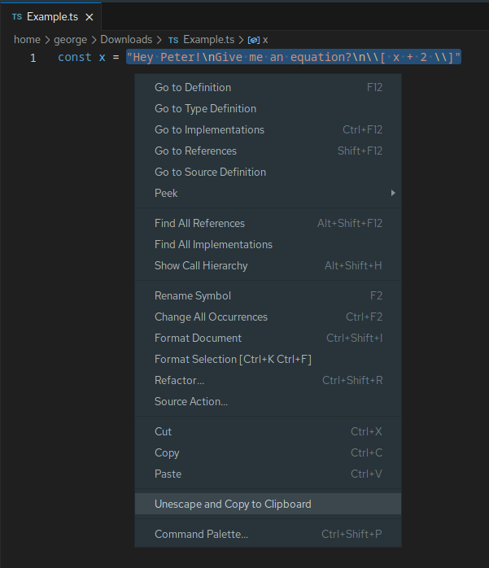

# unescape 

This extension provides an easy way to unescape Javascript/Typescript string literals and copy them to the clipboard.

## Features

Right-click on any string literal (including quotes) and click on "Unescape and Copy to Clipboard" in the Context Menu.

## Known Issues

Template literals are not supported for now.

## Release Notes

### 1.0.0

Initial release
